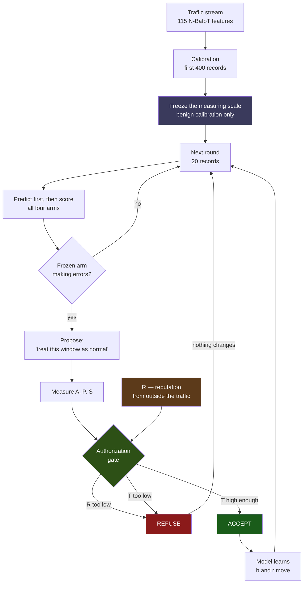
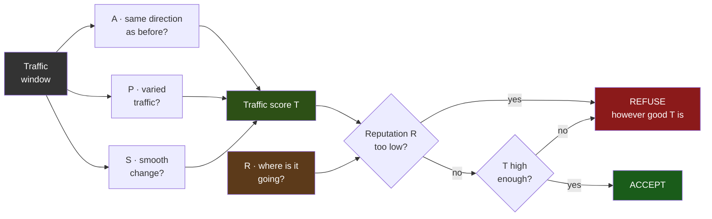
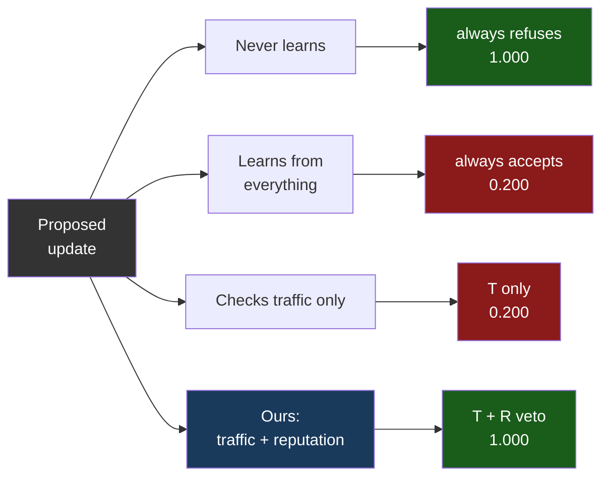

# Architecture — Trust-Aware IDS

Paste a block into mermaid.live and export PNG for the slide deck.

Keep labels SHORT. Mermaid sizes a box to its text, so long sentences inside
nodes are what make these diagrams sprawl. Explanations belong in the slide
notes, not in the boxes. Nothing should be left unconnected either — a subgraph
with no edges gets parked in a corner and wrecks the layout.

| Diagram | Use it for |
|---|---|
| 1. Pipeline | Slide 8, Framework/Architecture |
| 2. The decision | The one to actually present — readable from the back |
| 3. Four arms | Slide 11, explaining the comparison |

---

## Diagram 1 — Pipeline

**Say alongside it:** ADWIN watches the arm that *never* updates, so the trigger
is identical for all four and cannot be corrupted by any arm's own bad updates.
The measuring scale is frozen at calibration so the attacker cannot move the
ruler. A refused update changes nothing at all.

---

## Diagram 2 — The decision (present this one)

**The line to say:** A, P and S are all measured from the very traffic being
judged, so a patient attacker can raise all three. R is the only input that does
not come from the traffic — which is why it is allowed to overrule the rest.
Delete that one branch and you get the "checks traffic only" baseline, which was
fooled at rounds 40, 72, 73, 74 and 75.

---

## Diagram 3 — Four arms

Numbers are how often each caught the obvious repeat attack in Step 4, on real
N-BaIoT. Note that "never learns" also scores 1.000 — it is safe but cannot
adapt at all. Ours matches it on safety *while* still being able to accept
legitimate updates.
